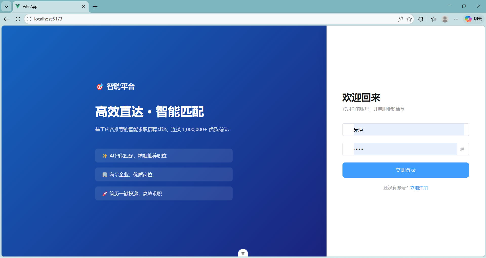

# Content-Based Job Recommendation System

> A full-stack job seeking & recruitment platform with TF-IDF content-based recommendation, built end-to-end as an undergraduate capstone project.

[](https://www.python.org/)
[](https://www.djangoproject.com/)
[](https://www.django-rest-framework.org/)
[](https://vuejs.org/)
[](https://vitejs.dev/)
[](https://scikit-learn.org/)
[](LICENSE)

---

## 📖 Overview

A complete recruitment platform serving three roles — **job seekers**, **enterprise HR**, and **administrators** — with a content-based recommendation engine that matches résumés to job postings using TF-IDF vectorization and cosine similarity.

Unlike collaborative-filtering systems that need large interaction histories, this approach works from day one with zero behavioral data — making it well suited to small platforms, new users, and any setting where the **cold-start problem** matters.

### Why content-based recommendation?

| Property | Benefit |
|---|---|
| **No behavioral data required** | Works on day-1 for new users and new postings |
| **Fully explainable** | Every recommendation traces back to specific keyword matches |
| **Lightweight** | Runs comfortably on a single SQLite-backed instance — no GPU, no Redis |
| **Production-ready algorithm** | TF-IDF + cosine similarity remains a standard baseline in industrial IR systems |

---

## 🏗️ Architecture

```
┌────────────────────────────────────────────────────────────────────┐
│  Presentation Layer    Vue 3 SPA · Vite · Vue Router · Pinia · Axios │
├────────────────────────────────────────────────────────────────────┤
│  API Layer             Django REST Framework · Serializers · Auth   │
├────────────────────────────────────────────────────────────────────┤
│  Business Layer        Views · Recommender Engine · Business Rules  │
├────────────────────────────────────────────────────────────────────┤
│  Data Layer            Django ORM · SQLite · 7 business tables      │
└────────────────────────────────────────────────────────────────────┘
                              ↑↓  JSON over HTTP (RESTful)
```

Front-end and back-end are fully decoupled. The Vue SPA talks to the Django backend exclusively through versioned REST endpoints, making it straightforward to swap the front-end (mobile, embedded portal) or scale the API horizontally.

---

## 🧠 Recommendation Engine

The core algorithm — implemented in [`recommender.py`](./recommender.py) — runs in five stages:

```
   ┌─────────┐   ┌─────────┐   ┌──────────┐   ┌───────────┐   ┌──────────┐
   │  Text   │   │  Token  │   │  Vector  │   │  Cosine   │   │   Rank   │
   │  Build  │ → │  jieba  │ → │  TF-IDF  │ → │  Similar. │ → │  Top-N   │
   └─────────┘   └─────────┘   └──────────┘   └───────────┘   └──────────┘
   skills+exp    Chinese WS    sklearn         resume × jobs   sorted
   +expected     +stopwords    TfidfVect.      pairwise        list
```

### 1. Document construction

For each résumé, concatenate skills, major, expected position, project experience, and work experience into a single document. For each job, concatenate title, description, required skills, education, and experience requirements.

### 2. Chinese word segmentation

`jieba.lcut` splits the text into tokens (Chinese has no whitespace between words), then a stopword filter removes high-frequency, low-information terms like 的, 工作, 岗位.

### 3. TF-IDF vectorization

```
TF-IDF(t, d) = TF(t, d) × log(N / DF(t))
```

`sklearn.feature_extraction.text.TfidfVectorizer` builds the joint vocabulary across the résumé and every active job, then projects each document into a sparse vector. Common terms get down-weighted; distinctive ones (e.g., *Vue*, *Kubernetes*, *策略产品*) carry the signal.

### 4. Cosine similarity

```
              v_r · v_j
cos(v_r, v_j) = ──────────────
              ‖v_r‖ · ‖v_j‖
```

`sklearn.metrics.pairwise.cosine_similarity` produces a single score in `[0, 1]` per job. Vector length normalization handles the (real) problem that résumés and job posts can differ wildly in length.

### 5. Ranking

Sort jobs by score in descending order. Return Top-N. The score is exposed in the API so the UI can render a match percentage.

---

## ✨ Features

### 🧑‍💼 Job Seeker
- Account registration, login, profile management
- Online résumé editor (skills, projects, work experience, expected position)
- Job browsing with keyword search and filters
- **Personalized recommendations** sorted by match score
- One-click application; track application status

### 🏢 Enterprise HR
- Company profile setup
- Post, edit, delist job openings
- View applicants per job, with résumé previews
- Update application status (interviewing / offered / rejected)

### 🛡️ Administrator
- User management (search, role assignment, deactivation)
- Job moderation queue (review & approve postings)
- Platform statistics dashboard (active users, posting volume, applications)

---

## 🛠️ Tech Stack

| Layer | Technology |
|---|---|
| Front-end framework | Vue 3 (Composition API) |
| Build tool | Vite 5 |
| HTTP client | Axios |
| State management | Pinia |
| Routing | Vue Router 4 |
| Back-end framework | Django 4.2 |
| API framework | Django REST Framework |
| Authentication | JWT (Simple JWT) |
| Database | SQLite (dev) — easily swappable to PostgreSQL |
| ORM | Django ORM |
| Chinese NLP | jieba |
| ML / similarity | scikit-learn (`TfidfVectorizer`, `cosine_similarity`) |

---

## 🚀 Quick Start

### Prerequisites
- Python 3.11+
- Node.js 18+
- npm or pnpm

### Backend

```bash
# Clone & enter
git clone https://github.com/<your-username>/job-recommender.git
cd job-recommender/backend

# Install dependencies
pip install -r requirements.txt

# Initialize database
python manage.py migrate

# Create admin user
python manage.py createsuperuser

# Start dev server
python manage.py runserver
# → http://127.0.0.1:8000
```

### Frontend

```bash
cd ../frontend

# Install dependencies
npm install

# Start dev server
npm run dev
# → http://127.0.0.1:5173
```

Open the front-end URL in your browser, register a Job Seeker account, and start using the platform.

---

## 📁 Project Structure

```
job-recommender/
├── backend/
│   ├── manage.py
│   ├── core/                  # Django settings, URL routing
│   │   ├── settings.py
│   │   ├── urls.py
│   │   └── wsgi.py
│   └── recruit/               # Main business app
│       ├── models.py          # User, Resume, Company, Job, Application
│       ├── views.py           # API view sets
│       ├── serializers.py     # DRF serializers
│       ├── recommender.py     # TF-IDF + cosine similarity engine
│       ├── admin.py
│       └── migrations/
├── frontend/
│   ├── index.html
│   ├── vite.config.js
│   ├── package.json
│   └── src/
│       ├── main.js
│       ├── App.vue
│       ├── router/
│       ├── stores/
│       ├── api/
│       └── views/
│           ├── Login.vue
│           ├── Register.vue
│           ├── seeker/        # Job seeker pages
│           ├── hr/            # Recruiter pages
│           └── admin/         # Admin pages
└── README.md
```

---

## 🌐 API Reference

Selected endpoints (full list in [`urls.py`](./backend/recruit/urls.py)):

### Auth
| Method | Endpoint | Purpose |
|---|---|---|
| POST | `/api/auth/register/` | Create account |
| POST | `/api/auth/login/` | Obtain JWT token pair |
| POST | `/api/auth/refresh/` | Refresh access token |

### Job Seeker
| Method | Endpoint | Purpose |
|---|---|---|
| GET / PUT | `/api/resume/me/` | Read or update own résumé |
| GET | `/api/jobs/` | Browse jobs (paginated, filterable) |
| GET | `/api/jobs/recommend/` | **TF-IDF personalized recommendations** |
| POST | `/api/applications/` | Apply to a job |
| GET | `/api/applications/me/` | List own applications |

### HR
| Method | Endpoint | Purpose |
|---|---|---|
| POST | `/api/jobs/` | Publish a job opening |
| PUT / DELETE | `/api/jobs/{id}/` | Edit / delist |
| GET | `/api/jobs/{id}/applicants/` | View applicants |
| PATCH | `/api/applications/{id}/status/` | Update application status |

### Admin
| Method | Endpoint | Purpose |
|---|---|---|
| GET / PATCH | `/api/admin/users/` | Manage users |
| GET / PATCH | `/api/admin/jobs/pending/` | Review pending job postings |
| GET | `/api/admin/stats/` | Platform statistics |

---

## 📸 Screenshots

| Login | Recommendations |
|:--:|:--:|
|  |  |

| HR Workbench | Admin Stats |
|:--:|:--:|
|  |  |

---

## 🧪 Testing

- **18 functional test cases** covering all three role flows — registration, résumé editing, job posting, application submission, moderation, status updates. All passing.
- **5 recommendation scenarios** with résumés of varying completeness; the engine produces sensibly ordered results and gracefully degrades when résumé text is sparse (low score → clear UX signal).

```bash
cd backend
python manage.py test
```

---

## 🗺️ Roadmap

- [ ] Replace TF-IDF with **sentence-BERT embeddings** for semantic matching (current limitation: synonym handling)
- [ ] Add **collaborative filtering** signal from application history to form a hybrid recommender
- [ ] Introduce **Learning-to-Rank** (e.g., LightGBM-LambdaRank) on top of the candidate set
- [ ] Container deployment (Docker + docker-compose), swap SQLite → PostgreSQL
- [ ] Migrate front-end build to **TypeScript** + stricter ESLint config
- [ ] Offline + online evaluation framework (NDCG, hit-rate, MRR)

---

## 👤 Author

**Song Geng** (宋庚) · Network Engineering (Cloud Computing), Zhengzhou University of Light Industry, Class of 2026

- Currently: Software Engineering Intern at **Aojie Technology** (傲杰科技)
- Areas of interest: Recommendation systems · Backend engineering · Python ecosystem
- Email: `<your-email>` · GitHub: [@your-username](https://github.com/your-username)

---

## 📄 License

MIT License — see [LICENSE](./LICENSE) for details.

---

*This project was developed as the author's undergraduate capstone (毕业设计) under the supervision of Lecturer Liang Wenjing (梁文静).*
